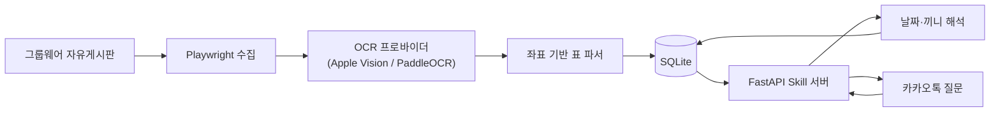

# 뷰밥 메뉴 알리미

사내 그룹웨어에 이미지로 게시되는 주간 식단표를 자동 수집하고, 온디바이스 한국어 OCR(macOS: Apple Vision, Windows: PaddleOCR)로 구조화한 뒤 카카오톡 질문에 답하는 챗봇입니다.

[카카오톡 채널 열기](https://pf.kakao.com/_xniMSX) · 현재 운영 버전 `v1.2`

> 공개 포트폴리오용 저장소에는 회사 내부 URL, 계정, 게시물 ID, 원본 이미지, OCR 결과와 실제 메뉴 DB를 포함하지 않습니다. 운영 값은 로컬 `.env`에서만 관리합니다.

## 프로젝트 한눈에 보기

| 항목 | 내용 |
|---|---|
| 수집 대상 | 자유게시판의 주간 식단 게시물(과거 지점 게시물은 파서 검증에만 활용) |
| 처리 | 게시물 탐색 → 이미지 수집 → 좌표 기반 OCR → 날짜·끼니·코너 정규화 → SQLite 저장 |
| 질문 예시 | `아침`, `금요일 점심`, `내일 저녁`, `월요일` |
| 응답 | 실제 날짜, 조식·중식·석식, 일반식·간편식·건강식·공통 PLUS 메뉴 |
| 기술 | Python, Playwright, Apple Vision / PaddleOCR, SQLite, FastAPI, Kakao 챗봇 Skill API, systemd |
| 조사 범위 | 최근 1년 72개 게시물, 168개 이미지 후보 전수 조사 |
| 실행 환경 | macOS(개인기) · Windows(사내 PC) · Linux(사내 서버) 운영 지원 |

## 사용자 규칙

- 월~금에는 요일을 이번 주 날짜로 해석합니다.
- 토~일에도 요일은 현재 주 날짜로 해석합니다.
- `아침`, `점심`, `저녁`만 말하면 오늘 해당 끼니를 보여줍니다.
- `월`, `월요일`처럼 끼니 없이 요일만 말하면 그날의 모든 식단을 보여줍니다.
- `금욜`, `낼점심`, `담주월 아침` 같은 일상적인 줄임말도 인식합니다.
- `다음주`, `담주`, `차주` 요청은 제공하지 않고 이번 주 식단만 조회할 수 있다고 안내합니다.
- `간편식`, `건강식`처럼 코너 이름만 말하면 그 코너가 나오는 끼니를 보여줍니다(간편식→조식, 건강식→중식). 세 끼니에 모두 나오는 `일반식`·`PLUS`는 끼니를 되묻습니다.
- 모르는 낱말이 섞이면(`오늘 커피`) 그날 전체 식단으로 넘기지 않고, 못 알아들은 낱말을 되짚어 주며 사용방법을 보여줍니다.
- `이번주 점심`처럼 요일이 빠진 질문은 오늘 식단으로 넘기지 않고 요일 입력을 안내합니다.
- 날짜·요일·끼니가 둘 이상 섞이거나 잘못된 날짜가 들어오면 임의로 선택하지 않고 다시 물어봅니다.
- 모든 답변에 `08월 21일(금)` 같은 실제 날짜를 표시합니다.
- `토`, `일`, `토요일`, `일요일`을 입력하면 식당이 운영되지 않는다고 안내합니다.
- 과거 식단 조회는 지원하지 않습니다. 1년치 자료는 예외 패턴 검증에만 사용합니다.
- 운영용 수집은 현재 주 날짜만 저장하며, 1년치 자료는 별도 학습 모드에서만 사용합니다.
- 차주 식단표가 주말에 게시되더라도 저장하지 않으므로 운영 자동 수집은 월요일 아침에 실행해야 합니다.
- PLUS 코너는 `공통 PLUS`로 표시합니다.
- 메뉴는 코너별 세로 목록으로 표시하고, 하루 전체 조회는 끼니별 말풍선으로 나눕니다.
- 모든 답변 아래의 `오늘의 아침`·`오늘의 점심`·`오늘의 저녁` 버튼을 누르면 입력 없이 오늘 해당 끼니를 바로 볼 수 있고, `사용방법` 버튼으로 도움말을 다시 열 수 있습니다.

## 실행 화면

### 날짜·끼니 질문

| `월 점심` → 월요일 중식 | `화요일` → 조식·중식·석식 전체 |
|---|---|
|  |  |

`월 점심`처럼 요일과 끼니를 함께 말하면 해당 끼니만, `화요일`처럼 요일만 말하면 조식·중식·석식을 끼니별 말풍선으로 보여줍니다.

### 사용방법


운영 채널 `v1.2`에서 실제 카카오톡으로 식단 조회, 도움말 응답과 `사용방법` 퀵 리플라이 재호출을 검증했습니다.

## 확인한 예외와 처리

| 상황 | 처리 |
|---|---|
| 대체휴무·공휴일·전사휴무 | 해당 날짜 세 끼 모두 미운영 |
| `석식 미운영`, `조식 미제공` | 해당 끼니만 미운영 |
| 특식·DAY·영양사 픽 | 특식 상태와 `✨` 표시 |
| 특식으로 건강식 없음 | 없는 코너를 추측해 만들지 않음 |
| 과거 지점별 게시물 혼재 | 학습·파서 검증에만 사용하고 사용자 응답에서는 지점을 노출하지 않음 |
| 사업장별로 나뉘어 올라온 주차 | 같은 끼니는 합쳐서 사업장 없이, 운영 여부가 갈리는 끼니만 사업장을 나란히 표시 |
| 안내 포스터 혼입 | 날짜 열과 끼니 행이 없는 이미지는 제외 |
| OCR 중복 | 날짜·지점·끼니·코너가 같으면 더 풍부한 결과를 채택 |

최근 1년치 게시물과 이미지 후보를 전수 조사해 표 구조 변화와 예외 패턴을 검증했습니다. 실제 게시물 목록, 원본 이미지, OCR 결과와 메뉴 데이터는 공개 저장소에 포함하지 않습니다.

## 구조



OCR은 게시물 수집 시에만 수행하고, 카카오 요청에는 SQLite 조회만 실행합니다.

## OCR 엔진

`src/menu_bot/ocr_provider.py`가 OCR 백엔드를 플랫폼별로 감춥니다.

| 플랫폼 | 엔진 | 비고 |
|---|---|---|
| macOS | Apple Vision (`vision_ocr.swift`, on-device) | 기존 운영 방식 그대로 유지 |
| Windows | PaddleOCR(`PP-OCRv5_mobile_det` + `korean_PP-OCRv5_mobile_rec`), 로컬 CPU 실행 | 외부 유료 OCR API 미사용 |
| Linux | 같은 PaddleOCR 조합, 로컬 CPU 실행 | 현재 운영 중인 사내 서버 |

모델명은 `PADDLE_DET_MODEL`, `PADDLE_REC_MODEL`, `PADDLE_ENABLE_MKLDNN`으로 바꿀 수 있습니다(비워두면 위 조합). PP-OCRv5 **server** 감지 모델은 Windows PC에서 oneDNN 오류로, Linux 서버에서는 세그멘테이션 폴트로 죽는 것을 실제로 확인했으므로 두 환경 모두 mobile 감지 모델을 씁니다.

`OCR_PROVIDER` 환경변수(`auto`\|`apple_vision`\|`paddleocr`)로 강제 지정할 수 있으며, 기본값 `auto`는 `platform.system()`으로 자동 선택합니다. 두 엔진 모두 결과를 동일한 `{text, confidence, x, y, width, height}` 정규화 좌표(좌측 하단 원점, y축 위로 증가)로 변환해 파서가 엔진을 구분하지 않고 동작합니다.

**Linux OCR 검증**: 같은 검증을 사내 Linux 서버(Ubuntu 24.04, Python 3.12)에서 다시 수행했습니다. 실제 게시물 3주치 이미지 6장을 서버 PaddleOCR로 OCR해 Apple Vision 기준 결과와 비교한 결과, 날짜·끼니·코너 셀 구성 115개가 전부 동일하고 휴무/특식 상태 판정도 115/115 일치했습니다(서버 쪽에서 화요일 조식 간편식 1개를 오히려 더 정확히 분리해 116개). 글자 단위로는 `숭늉`→`숭능`, `깍두기`→`짝두기` 같은 오인식과 반대로 `최고강주`→`최고강추`, `북어해자국`→`북어해장국`처럼 더 정확해진 경우가 섞여 있고, 장식 서체 줄에서 짧은 노이즈 조각(`004`, `oo` 등)이 드물게 끼어듭니다. 끼니·날짜·휴무/특식 판정에는 영향이 없습니다.

노이즈 조각을 OCR 신뢰도 하한선으로 걸러보려 했지만 쓸 수 없었습니다. 실제 값을 재보면 노이즈 `oo`가 0.67인데 정상 항목 `숭늉`은 0.40~0.82에 흩어져 있어, 노이즈를 지우는 임계값이 정상 메뉴를 먼저 지웁니다(수집분 615줄 중 89줄이 0.5 미만). 그래서 임계값을 넣지 않고 그대로 뒀습니다.

**Windows OCR 검증**: 1년치 실제 게시물 중 대체휴무 전체휴무, 특정 끼니 미운영, 특식/DAY, PLUS 공통 코너가 섞인 실제 이미지 6장을 PaddleOCR로 다시 OCR해 Apple Vision 결과와 파싱 결과(항목 수·상태 분류·날짜별 셀 구성)를 비교했고, 6장 전부 100% 일치했습니다. 글자 단위로는 `숭늉`이 `숭능`/`숭늄`처럼 드물게 오인식되는 등 사소한 품질 차이가 있지만 끼니·날짜·특식/휴무 판정에는 영향이 없습니다. Windows 실제 그룹웨어 계정으로 라이브 로그인 → 수집 → PaddleOCR → 파싱 → SQLite 저장 → 카카오 스킬 응답까지 전 과정을 실제로 확인했습니다.

## OCR 오인식·노이즈 정리

PaddleOCR은 끼니·날짜·휴무/특식 판정에는 영향이 없을 정도로 정확하지만 글자 단위로는 틀립니다. 1년치에서 가장 많이 나오는 항목인 `숭늉`(466회)을 `숭능`·`숭융`·`승능`으로 읽고, 장식 서체 줄에서는 `004`·`oo` 같은 조각을 끼워 넣습니다. 사용자에게 그대로 보여줄 값이라 `src/menu_bot/corrections.py`에서 세 겹으로 정리합니다.

| 단계 | 규칙 | 근거 |
|---|---|---|
| 노이즈 버리기 | 한글이 한 글자도 없는 항목은 버린다 | 1년치 고유 항목 2211개 중 한글 없는 항목은 15개였고 전부 장식 문구·로고 조각(`Pulmuone`, `Happy New year`, `-11`, `1R` …) |
| 표기 교정 | 한국어에 없는 표기를 고정 목록으로 바꾼다 | 실제 이미지로 PaddleOCR과 Apple Vision 결과를 대조해 모음. 반대로 PaddleOCR이 더 정확했던 표기는 넣지 않음 |
| 어휘집 교정 | 어휘집에 없고 한 글자만 다른 어휘집 항목이 **딱 하나**일 때만 바꾼다 | 길이가 같은 후보만 보고, 후보가 둘 이상이면 손대지 않는다 |

어휘집에도 오인식이 섞여 있어(Apple Vision이 잘못 읽은 값이 그대로 들어감) **등장 3회 이상**인 항목만 교정 후보로 씁니다. 오인식은 보통 한두 번, 실제 메뉴 이름은 여러 번 반복되기 때문입니다. 실제로 어휘집에는 `부주잡채`(1회)가 있는데, 하한이 없으면 올바로 읽은 `부추잡채`를 그 오인식으로 되돌리게 됩니다.

**측정 결과**: 1년치에서 고르게 뽑은 실제 이미지 25장(셀 311개)으로 교정 전후를 Apple Vision 기준과 대조했습니다.

| | 기준과 다른 셀 |
|---|---|
| 교정 전 | 173/311 (56%) |
| 교정 후 | **78/311 (25%)** |

완전히 같아진 셀 95개, 새로 어긋난 셀 0개. 셀 구성과 휴무/특식 판정은 교정 전후 모두 311/311 일치했습니다. 고정 목록에 없던 `미슷가루`→`미숫가루`, `[뜻배기]`→`[뚝배기]` 같은 것도 어휘집 층이 잡았습니다.

남는 한계는 **끼어든 조각 중 한글로 된 것**입니다(예: 장식 줄에서 온 `해지공탕`). 한글이 있어서 노이즈 규칙에 걸리지 않고, 어휘집에 한 글자 차이 후보도 없어 그대로 남습니다.

### 어휘집 만들기

어휘집은 실제 메뉴 데이터라서 공개 저장소에 넣지 않습니다(`data/`는 git 제외). 학습용 게시물 목록으로 직접 만듭니다.

```bash
menu-bot build-vocab data/source_manifest.json
# → data/menu_vocab.json (경로는 MENU_VOCAB_PATH로 변경 가능)
```

파일이 없으면 어휘집 층만 조용히 꺼지고 노이즈·표기 교정은 그대로 동작합니다. 새 메뉴가 쌓이면 다시 만들어 주면 됩니다. 원본 OCR 결과는 `<이미지>.ocr.json` 캐시에 남아 있어, 교정 규칙을 고친 뒤 `menu-bot ingest`만 다시 돌리면 OCR 없이 반영됩니다.

## 비용과 운영 범위

개인 맥/사내 Windows PC와 ngrok Free를 사용하면 고정 월 비용은 0원입니다.

- Apple Vision / PaddleOCR, SQLite, FastAPI: 로컬 실행, 무료
- 카카오 일반 스킬 응답: 유료 Event API를 사용하지 않음
- ngrok Free: 고정 개발 도메인 1개, 월 20,000 HTTP 요청, 1GB 전송

500명이 근무일마다 하루 한 번 조회하면 월 약 11,000건입니다. 하루 두 번이면 약 22,000건으로 ngrok 무료 한도를 넘을 수 있습니다. 시범 운영 후 한도에 가까워지면 Cloudflare Workers 무료 엔드포인트로 이전할 수 있습니다. 서버 PC가 잠자거나 종료되면 챗봇도 응답하지 않습니다.

> **ngrok 최소 에이전트 버전 이슈(Windows, 미해결)**: 이 ngrok 계정은 에이전트 3.20.0 이상을 요구합니다(`ERR_NGROK_121`). winget으로 설치되는 3.3.1은 이 조건을 충족하지 못하고, `ngrok update`로 최신 버전을 받으면 회사 Defender가 `Trojan:Win32/Kepavll!rfn`으로 새 바이너리를 격리합니다(Go 바이너리 자동 업데이트에 흔한 오탐이지만 사내 PC에서 임의로 예외 처리하지 않았습니다). 실제 터널 운영 전 IT에 `ngrok.exe`(경로: `%LOCALAPPDATA%\Microsoft\WinGet\Packages\Ngrok.Ngrok_*\ngrok.exe` 및 갱신 파일) 허용 또는 3.20.0 이상 버전의 사전 승인을 요청해야 합니다.

## Windows 설치

요구사항: Windows 10/11, Python 3.13(PaddleOCR wheel은 3.13에서만 검증. 3.14는 미검증), Google Chrome, PowerShell 5.1+.

```powershell
cd "회사 PC의 프로젝트 경로"
powershell -ExecutionPolicy Bypass -File scripts\install-windows.ps1
copy .env.example .env
notepad .env   # 그룹웨어 계정, 카카오 토큰, ngrok 도메인 입력
powershell -ExecutionPolicy Bypass -File scripts\check-windows-env.ps1
```

`check-windows-env.ps1`은 Python/Chrome/ngrok 설치 여부, ngrok 설정 파일 유효성, 아웃바운드 443 연결, `.env` 필수 키 존재 여부(값은 출력하지 않음), 그룹웨어 호스트 접속 가능 여부를 읽기 전용으로 점검합니다.

### Windows 실행

```powershell
# 터미널 1: 서버
powershell -ExecutionPolicy Bypass -File scripts\run-windows-server.ps1

# 터미널 2: 터널
powershell -ExecutionPolicy Bypass -File scripts\run-windows-tunnel.ps1

# 수동 수집(평소엔 자동 실행되므로 필요할 때만)
.venv\Scripts\menu-bot.exe scrape --pages 2 --output data\latest_manifest.json
.venv\Scripts\menu-bot.exe ingest data\latest_manifest.json
.venv\Scripts\menu-bot.exe ask "금요일 아침"
```

`run-windows-server.ps1`, `run-windows-tunnel.ps1`은 내부에 재시작 루프가 있어 uvicorn/ngrok 프로세스가 죽으면 5초 뒤 자동으로 다시 시작하고, `logs\*.log`에 날짜별로 기록합니다(30일 지난 로그는 자동 삭제).

## 다음 주 게시글 확인(주말 자동 폴링)

차주 식단표는 보통 주말에 게시되지만 운영 DB는 항상 "이번 주"만 저장하므로, 평소 운영 수집은 월요일 아침 한 번만 실행됩니다. 다만 게시가 언제 끝나는지 미리 알 수 있으면 월요일 0시부터 곧바로 응답할 수 있어, 별도의 확인 작업을 둡니다.

- **금요일 22:00** 1회, **토·일요일 00:05부터 2일간 2시간 간격** 반복으로 `menu-bot check-next-week`가 게시글 제목만 가볍게 확인합니다(이미지 다운로드 없음).
- 다음 주 게시글을 찾으면 **그 자리에서** 이미지 다운로드·OCR·파싱까지 끝내고 `week_start`를 다음 주 월요일로 저장합니다. 카카오 응답은 실제 달력 날짜로 필터링되므로, 데이터가 주말에 미리 들어가 있어도 월요일 0시 전에는 노출되지 않다가 자정이 지나는 순간 자동으로 조회됩니다.
- 한 번 확인되면 상태 파일(`data/next_week_watch_state.json`)에 대상 주차가 기록되어, 같은 주말 안의 나머지 2시간 간격 실행은 그룹웨어에 다시 접속하지 않고 즉시 종료합니다(주차가 바뀌면 다음 주에 자동으로 다시 확인).
- 월요일 08:00 운영 수집은 안전망으로 그대로 유지합니다. 주말에 이미 확인·저장됐다면 같은 게시물을 다시 처리해도 동일한 `source_post_id`로 안전하게 덮어씁니다.
- **저장된 메뉴 항목이 1건 이상일 때만 "확보"로 봅니다.** 게시글 제목만 먼저 올라오고 이미지가 아직 없거나 OCR이 아무것도 읽지 못한 경우를 성공으로 처리하면 폴링이 멈춰 그 주 식단을 통째로 놓칩니다.
- 시도마다 결과(`not_posted` / `error` / `ingest_failed` / `confirmed`)와 사유를 상태 파일에 남깁니다. 일요일 22시 마감 점검이 "무엇이 몇 번 실패했는지"를 그대로 알릴 수 있게 하기 위함입니다.

### 알림 메일

| 시점 | 조건 | 내용 |
|---|---|---|
| 주말 폴링·시간별 재시도 중 아무 때나 | 식단 확보 성공 | 대상 주차, 수집 통계, **저장된 식단 구조 전체**(날짜 → 끼니 → 코너 → 항목) |
| 일요일 22:00 | **마지막 시도까지 해 본 뒤** 여전히 미확보 | 시도 요약(사유별 횟수), 최근 8회 시도와 오류 메시지, 다음 조치 안내 |

마감 점검은 상태 파일만 보고 판정하지 않고, 그 자리에서 수집을 한 번 더 시도한 다음 판정합니다. 2시간 간격 폴링의 마지막 회차(일 22:05)가 5분 뒤에 성공하는 경우 헛경보를 먼저 보내게 되기 때문입니다.

둘 다 같은 주차에 한 번만 보냅니다(상태 파일의 `success_notified_week`, `deadline_alert_sent_week`). 마감 알림은 **발송이 실패하면 기록하지 않으므로** 다음 실행에서 다시 시도합니다. 반대로 성공 알림 발송이 실패해도 수집 자체는 성공으로 처리합니다 — 알림이 안 됐다고 식단 데이터를 버릴 이유는 없기 때문입니다.

SMTP 설정(`SMTP_HOST`, `SMTP_PORT`, `SMTP_SECURITY`, `SMTP_USER`, `SMTP_PASSWORD`, `NOTIFY_EMAIL_FROM`, `NOTIFY_EMAIL_TO`)이 비어 있으면 발송을 건너뛰고 로그만 남깁니다. `check-linux-env.sh`가 미설정 항목과 SMTP 연결 가능 여부를 점검합니다. Gmail은 2단계 인증 계정의 **앱 비밀번호**가 필요합니다.

### 사업장별로 나뉘어 올라온 주차

식당은 평소 두 사업장 메뉴가 같아 **[뷰웍스] 한 건**으로 올리고, 끼니 미운영 같은 **운영 예외가 있는 주에만 [안양]·[화성]으로 나눠** 올립니다. 즉 사업장 게시글이 올라왔다면 그것이 그 주 식단표이고, 기다릴 통합 게시글은 없습니다.

2026-08-24 주차가 그런 주였는데, 여기서 사고가 났습니다. 113건이 저장되자 "수집 완료" 알림이 나가고 폴링이 멈췄지만 챗봇은 공통 식단을 고르지 못해 "확인할 수 없어요"로 답했습니다. **확보 판정을 응답 생성과 같은 기준으로 하지 않아 알림과 실제 답이 어긋난 것**입니다. 지금은 `_choose_common_menu`, 즉 응답을 만들 때 쓰는 바로 그 기준으로 확보를 판정합니다.

두 사업장 식단을 셀 단위로 대조해 보니 42칸 중 31칸이 완전히 같았고, 진짜 차이는 "어느 요일 조식을 쉬는가"뿐이었습니다(안양은 화요일, 화성은 목요일 조식 미운영). 나머지 차이는 전부 OCR 오인식이었습니다. 그래서 이렇게 처리합니다.

- 끼니별로 **운영/미운영이 같으면** 사업장을 밝히지 않고 하나로 합칩니다(코너별로 더 풍부하게 읽힌 쪽 채택).
- **운영 여부가 갈리는 끼니만** 사업장을 나란히 보여줍니다. 사용자는 둘 중 한 곳에 있으므로 한쪽만 골라 보여주면 나머지 절반이 닫힌 식당으로 가게 됩니다.
- "통합 식단표가 없어서 대신 안내한다" 같은 사정 설명은 넣지 않습니다. 판단은 서버가 끝냅니다.
- 알림 메일에는 그 주가 사업장별로 나뉘어 올라왔다는 사실을 적습니다. 그 자체가 "이번 주에 운영 예외가 있다"는 신호이기 때문입니다.

```text
🍽 08월 25일(화)

[조식]
※ 이 끼니는 사업장에 따라 달라요

〔안양〕
<운영 안내>
- 조식 미운영

〔화성〕
✨ <일반식>
- *볶음밥DAY*
...

[중식]                     ← 같으니까 한 번만
<일반식>
- 해물순두부찌개
...
```

### 일요일 22시 이후 — 1시간 간격 재시도

마감 알림을 보냈다고 손을 놓지 않습니다. **일요일 23:00부터 금요일 23:00까지 매시 정각**(`menubot-ensure.timer`) 확보 여부를 확인하고, 없으면 그 자리에서 다시 수집합니다. 확보되면 성공 알림을 보냅니다(주차당 1통).

- **확보 판단은 상태 파일이 아니라 DB를 봅니다.** 월요일 아침 정기 수집이 상태 파일을 건드리지 않고 DB만 채우는 경우가 있어, 상태 파일만 보면 이미 들어온 주차를 계속 다시 긁습니다.
- **이미 있으면 그룹웨어에 접속하지 않고 즉시 끝납니다**(실측 0.2초). systemd 타이머는 스스로를 끌 수 없으므로, "루프가 멈춘다"는 것을 이렇게 아무 일도 하지 않는 것으로 구현했습니다.
- 대상 주차는 **토·일에는 다가오는 월요일, 월~금에는 그 주 월요일**입니다. 덕분에 일요일 23시와 월요일 1시가 같은 주차를 가리켜 자정을 넘겨도 엉뚱한 주로 넘어가지 않습니다.
- 토·일 낮은 2시간 간격 주말 폴링이 이미 돌고 있어, 이 타이머는 그 시간대를 비워 두고 중복으로 그룹웨어를 두드리지 않습니다.

식단표를 못 받은 상태에서 사용자가 물어보면 없는 식단을 지어내지 않고 이렇게 답합니다.

```text
08월 24일(월) 식단표가 아직 그룹웨어에 올라오지 않았어요.
올라오면 자동으로 반영되니 조금 뒤에 다시 물어봐 주세요. 🙏
```

### 주말 시나리오 검증

기준 시각을 옮겨야 하는 검증은 `--now`로 합니다. 서버 시스템 시계를 바꾸면 같은 장비의 다른 서비스 로그와 DB 타임스탬프가 전부 어긋나므로 시계는 건드리지 않습니다.

```bash
# 다음 주 게시글이 아직 없는 상황
menu-bot check-next-week --now 2026-08-22T02:05
# 게시글이 이미 있는 주차를 대상으로 삼아 성공 경로 확인
menu-bot check-next-week --now 2026-08-14T22:00
# 그룹웨어 접속 실패 상황
GROUPWARE_URL=https://unreachable.invalid/x menu-bot check-next-week --now 2026-08-22T06:05
# 일요일 22시 마감 점검(미확보면 알림 메일)
menu-bot next-week-deadline --now 2026-08-23T22:00
```

`DATABASE_PATH`와 `NEXT_WEEK_STATE_PATH`를 임시 경로로 덮어쓰면 운영 DB·상태 파일을 건드리지 않고 검증할 수 있습니다.

## Windows 자동 시작(작업 스케줄러)

Windows 서비스 대신 **작업 스케줄러**를 선택했습니다. Playwright(Chrome)와 ngrok을 사용자 세션 그대로 띄우는 편이 서비스용 세션 0 격리 문제나 별도 서비스 래퍼(NSSM 등) 없이 훨씬 단순하고, 관리자 권한 없이 현재 사용자 계정만으로 등록·점검·삭제할 수 있기 때문입니다. 재시작은 스케줄러의 제한된 횟수 대신 각 `run-windows-*.ps1` 안의 무한 루프가 1차로 책임지고, 스케줄러 설정에도 방어적으로 재시작(최대 999회, 1분 간격)을 걸어 둡니다.

```powershell
powershell -ExecutionPolicy Bypass -File scripts\register-windows-tasks.ps1
```

등록되는 작업:

| 작업 이름 | 트리거 | 동작 |
|---|---|---|
| `VieworksMenuBot-Server` | 로그온 시 | FastAPI 서버, 죽으면 5초 후 자동 재시작 |
| `VieworksMenuBot-Tunnel` | 로그온 시 | ngrok 터널, 죽으면 5초 후 자동 재시작 |
| `VieworksMenuBot-Collect` | 매주 월요일 08:00 | 운영 수집(scrape+ingest), 안전망 |
| `VieworksMenuBot-NextWeekWatch-Friday` | 매주 금요일 22:00 | 다음 주 게시글 1회 확인 |
| `VieworksMenuBot-NextWeekWatch-Weekend` | 매주 토요일 00:05부터 2일간 2시간 간격 | 다음 주 게시글 반복 확인(확인되면 즉시 종료) |

확인: `Get-ScheduledTask -TaskName 'VieworksMenuBot-*'` · 제거: `Get-ScheduledTask -TaskName 'VieworksMenuBot-*' | Unregister-ScheduledTask -Confirm:$false`

## Linux 서버 설치 (현재 운영 위치)

요구사항: Ubuntu 24.04, Python 3.12, systemd 252+(`OnCalendar`의 시간대 지정에 필요), systemd 등록 시에만 sudo.

```bash
cd /home/ubuntu/cafeteria-menu-kakao-bot
./scripts/install-linux.sh          # venv + PaddleOCR + Playwright Chromium + ngrok
cp .env.example .env && chmod 600 .env
$EDITOR .env                        # 그룹웨어 계정, 카카오 토큰, NGROK_DOMAIN, MENUBOT_PORT
mkdir -p ~/.config/ngrok && chmod 700 ~/.config/ngrok
$EDITOR ~/.config/ngrok/ngrok.yml   # authtoken (chmod 600)
./scripts/check-linux-env.sh        # 읽기 전용 점검
sudo ./scripts/register-linux-services.sh
```

`check-linux-env.sh`는 venv·PaddleOCR·Chromium·ngrok 설치 여부, ngrok 설정 유효성, `.env` 필수 키 존재(값은 출력하지 않음), 그룹웨어 접속 가능 여부, 포트 충돌, systemd 유닛 상태, DB 항목 수를 읽기 전용으로 점검합니다. 되돌리려면 `sudo ./scripts/unregister-linux-services.sh`로 `menubot-*` 유닛만 지웁니다.

서버에는 Google Chrome이 없어 Playwright 번들 Chromium을 씁니다(`BROWSER_CHANNEL=auto`가 Linux를 감지). Ubuntu 24.04는 AppArmor가 비특권 user namespace를 막아 번들 Chromium의 샌드박스가 뜨지 않으므로 `--no-sandbox`로 실행합니다(그룹웨어 페이지만 여는 headless 전용 프로세스).

### 사내 DNS와 포트

이 서버는 공용 DNS(8.8.8.8/1.1.1.1)를 쓰고 있어 그룹웨어 호스트가 공인 IP로 해석되고, 그 공인 IP는 내부망에서 닿지 않습니다(NAT 헤어핀 없음). 사내 DNS가 주는 내부 주소를 `/etc/hosts`에 두 줄만 고정해 해결했습니다. 다른 서비스의 DNS 동작에 영향이 없도록 `systemd-resolved` 설정은 건드리지 않았습니다.

```text
<그룹웨어 내부 IP>   groupware.example.com
<SSO 내부 IP>        login.example.com
```

포트는 `MENUBOT_PORT`(기본 `18080`)를 쓰고 `127.0.0.1`만 바인딩합니다. 공인 노출은 ngrok 터널이 담당하므로 스킬 서버를 사내망에 직접 열지 않습니다. 이 서버에는 다른 팀 서비스가 함께 돌고 있으므로, 배포 전에 `ss -tlnp`로 사용 중인 포트를 확인하고 겹치지 않는 값을 골라야 합니다(`check-linux-env.sh`가 충돌을 점검합니다).

## Linux 자동 시작(systemd)

Windows는 작업 스케줄러, Linux는 systemd를 씁니다. Playwright와 ngrok을 로그인 세션 없이도 부팅 직후부터 돌려야 하므로 시스템 유닛으로 등록하고, 실행 계정만 `ubuntu`로 낮춥니다. Windows 스크립트에 있던 재시작 루프는 systemd의 `Restart=always`가 대신합니다.

```bash
sudo ./scripts/register-linux-services.sh
```

| 유닛 | 트리거 | 동작 |
|---|---|---|
| `menubot-web.service` | 부팅 시 | FastAPI 서버(`127.0.0.1:18080`), 죽으면 5초 후 재시작 |
| `menubot-tunnel.service` | 부팅 시 | ngrok 터널, 죽으면 10초 후 재시작 |
| `menubot-collect.timer` | 매주 월요일 08:00 KST | 운영 수집(scrape+ingest), 안전망 |
| `menubot-nextweek-friday.timer` | 매주 금요일 22:00 KST | 다음 주 게시글 1회 확인 |
| `menubot-nextweek-weekend.timer` | 토·일 00:05부터 2시간 간격 KST | 다음 주 게시글 반복 확인(확인되면 즉시 종료) |
| `menubot-nextweek-deadline.timer` | 매주 일요일 22:00 KST | 마지막 시도 후 미확보면 알림 메일 발송 |
| `menubot-ensure.timer` | 일 23:00~금 23:00 매시 정각 KST | 식단이 DB에 없으면 재수집(있으면 즉시 종료) |

`menubot-web`과 `menubot-tunnel`은 서로 `BindsTo`로 묶지 않았습니다. 웹 서버가 재시작되는 몇 초 동안 터널까지 내려가면 터널은 스스로 다시 올라올 근거가 없어 영구히 죽기 때문입니다. 둘 다 각자 `Restart=always`로 살아나게 두고, 그 몇 초 동안 카카오가 받는 502는 재질문으로 해소됩니다.

`menubot-collect.service`, `menubot-nextweek.service`, `menubot-nextweek-deadline.service`, `menubot-ensure.service`는 타이머가 부르는 `oneshot`이라 `enable`하지 않습니다. 수집과 주말 폴링에는 `MemoryHigh=3G` + `MemoryMax=4G`를 걸어 PaddleOCR과 Chromium이 같은 장비의 다른 서비스를 밀어내지 못하게 했습니다(마감 점검도 마지막 수집 시도를 하므로 같은 상한).

**시간대 주의**: 이 서버의 시스템 시간대는 `America/New_York`입니다. 다른 서비스의 로그 시각을 흔들 수 없어 시스템 시간대는 바꾸지 않고, 대신 각 타이머의 `OnCalendar`에 `Asia/Seoul`을 명시했습니다(systemd 252+ 지원). 조회 로직은 코드에서 항상 명시적으로 `Asia/Seoul`을 쓰므로 시스템 시간대와 무관하게 동작합니다.

```bash
# 상태와 다음 실행 시각
systemctl status menubot-web menubot-tunnel
systemctl list-timers 'menubot-*'

# 로그 (스크립트가 logs/*.log에도 KST로 남깁니다)
journalctl -u menubot-web -n 50
journalctl -u menubot-collect -n 50

# 수동 실행
sudo systemctl start menubot-collect.service
sudo systemctl start menubot-nextweek.service
```

## macOS 설치

요구사항: macOS 14+, Python 3.11+, Google Chrome, Xcode Command Line Tools.

```bash
cd "/Users/hongmin/Desktop/자동화/cafeteria-menu-kakao-bot"
python3 -m venv .venv
source .venv/bin/activate
pip install -e '.[dev]'
playwright install chromium
cp .env.example .env
```

```dotenv
GROUPWARE_USER=사원번호
GROUPWARE_PASSWORD=비밀번호
GROUPWARE_URL=https://groupware.example.com/path/to/board
POST_PREFIXES=뷰웍스
DEFAULT_LOCATION=
DATABASE_PATH=data/menus.db
TIMEZONE=Asia/Seoul
KAKAO_WEBHOOK_TOKEN=충분히-긴-임의-문자열
NGROK_DOMAIN=계정에-할당된-도메인.ngrok-free.dev
```

### macOS 실행

```bash
menu-bot scrape --pages 2 --output data/latest_manifest.json
menu-bot ingest data/latest_manifest.json
# 1년치 OCR·파서 검증 전용. --learning은 항상 `menus.learning.db`(운영 DB와 다른 파일)에 저장된다.
menu-bot ingest data/history_manifest.json --learning
menu-bot ask "금요일 아침"

# 터미널 1
./scripts/run-mac-server.sh

# 터미널 2
./scripts/run-mac-tunnel.sh
```

카카오 스킬 URL:

```text
https://NGROK_DOMAIN/kakao/skill/KAKAO_WEBHOOK_TOKEN
```

## 카카오 챗봇 연결

1. `뷰밥 메뉴 알리미` 봇에 위 HTTPS 주소를 POST 스킬로 등록합니다.
2. 식단 질문용 블록에 발화 예시와 `sys.any` 파라미터를 연결합니다.
3. 블록 응답을 등록한 스킬로 설정합니다.
4. 봇 테스트에서 `오늘 점심`, `금요일 아침`, `월요일`, `토요일 점심`을 확인합니다.
5. 카카오톡 채널을 연결하고 배포합니다.

서버는 SkillPayload의 `userRequest.utterance`를 읽고 SkillResponse 2.0으로 답합니다. 긴 하루 전체 메뉴는 끼니별 말풍선으로 나누며, 모든 응답에 `오늘의 아침`·`오늘의 점심`·`오늘의 저녁`·`사용방법` 퀵 리플라이를 포함합니다. 오늘 식단 버튼을 누르면 별도 입력 없이 해당 끼니를 조회합니다. 이미 열어 둔 채팅방에는 웰컴 메시지가 소급 생성되지 않으므로 `안녕하세요` 또는 `사용방법`을 한 번 입력하면 도움말과 버튼이 표시됩니다.

## 보안

- `.env`, 이미지, OCR 캐시, SQLite DB와 게시물 목록은 Git 제외 대상입니다.
- 카카오 요청 중에는 그룹웨어에 로그인하지 않습니다.
- 웹훅 URL에는 긴 임의 토큰을 붙입니다.
- 비밀번호와 토큰을 로그나 README에 출력하지 않습니다.
- 공개 Git에는 내부 주소나 실제 식단 데이터를 커밋하지 않습니다.
- Linux 서버에서는 `.env`와 `~/.config/ngrok/ngrok.yml`을 `600`, 앱 디렉터리를 `700`으로 두고, FastAPI는 `127.0.0.1`만 바인딩합니다.
- PaddleOCR은 완전히 로컬 CPU에서만 실행되며 이미지나 인식 결과를 외부로 전송하지 않습니다.
- Windows의 ngrok 인증 설정(`windows-transfer-secrets/ngrok.yml`)은 Git 제외 대상이며, `%LOCALAPPDATA%\ngrok\ngrok.yml`로 복사해 사용하고 저장소에는 두지 않습니다.

## 검증

```bash
pytest
python -m compileall -q src tests
curl http://127.0.0.1:8000/health          # macOS
curl http://127.0.0.1:18080/health         # Linux 서버(MENUBOT_PORT)
```

Windows에서는 `.venv\Scripts\python.exe`로 동일하게 실행하거나 `scripts\check-windows-env.ps1`로 환경을 점검합니다. 이번 작업에서 실제로 확인한 항목:

- `pytest` 70개 전체 통과(신규 `next_week_watch` 테스트 4개 포함), `compileall` 통과.
- 실제 그룹웨어 계정으로 라이브 로그인 → 3개 게시물 스크래핑 → PaddleOCR OCR → 파싱 → SQLite 저장(이번 주 36개 메뉴, 지난 2주치 79개는 운영 DB 정책대로 필터링).
- 실행 중인 FastAPI 서버에 실제 `SkillPayload` POST(`목요일 점심`)로 SkillResponse 2.0 정상 응답(HTTP 200) 확인.
- Git 추적 대상 파일에 실제 계정/토큰/내부 URL이 없는지 값 대조로 검사(발견 없음).
- 재부팅/로그오프 후 자동 시작은 작업 스케줄러 등록까지 완료했으며, 실제 재부팅을 통한 검증은 아직 하지 않았습니다.

### 조회 규칙·OCR 교정 검증

- `pytest` 270개 통과. 코너→끼니 매핑, 모르는 낱말 판정, 기존 안내 회귀, OCR 교정·노이즈 규칙을 표로 나열해 고정했습니다.
- 1년치(게시물 72개·이미지 168장) 전수 파싱으로 코너×끼니 분포를 세어 `간편식`→조식, `건강식`→중식 매핑의 근거를 확인했습니다(다른 끼니 등장 0회).
- 실제 이미지 25장으로 OCR 교정 전후를 대조해 기준과 다른 셀이 56%→25%로 줄고 새로 어긋난 셀이 0건임을 확인했습니다.
- 운영 중인 공인 주소로 `오늘 간편식`·`점심 간편식`·`오늘 커피`·`오늘 삼각김밥 있어?` 등을 실제 카카오 `SkillPayload`로 보내 응답을 확인했습니다.
- 1년치 2196종을 전수 검토해 오인식 68건을 찾아 교정 규칙에 반영했습니다. 가장 많았던 것은 `장`(醬)을 `정`·`자`·`창`·`작`·`당`·`중`·`짱`·`잠`으로 읽는 계통 오류였습니다. 규칙을 2196종 전체에 다시 적용해 의도한 68건만 바뀌고 나머지는 그대로인 것을 확인했습니다(`감자조림`·`완자조림`처럼 규칙과 글자가 겹치는 실제 메뉴가 깨지지 않는지 테스트로 고정).
- 시간별 재시도를 서버에서 실제로 돌려 확인했습니다: 식단이 있으면 0.2초에 종료(그룹웨어 접속 없음), 없으면 일 23:00·월 01:00·화 10:00 모두 같은 주차(`2026-08-24`)를 대상으로 재시도, 실제 수집 성공 후에는 다시 즉시 종료.

### Linux 서버 이전 검증

- `pytest` 72개 전체 통과(Python 3.12).
- 실제 게시물 6장으로 서버 PaddleOCR vs Apple Vision 비교: 셀 구성·휴무/특식 판정 115/115 일치(위 **Linux OCR 검증** 참고).
- 실제 그룹웨어 계정으로 서버에서 라이브 로그인 → 3개 게시물 스크래핑 → 이미지 다운로드 → PaddleOCR → 파싱 → SQLite 저장까지 수행하고, 이번 주 36개 메뉴가 기존 운영 DB와 동일하게 저장되는지 항목 단위로 대조했습니다(지난 2주치는 운영 DB 정책대로 필터링).
- 고정 ngrok 도메인으로 `/health`와 실제 카카오 `SkillPayload` POST를 공인 주소로 확인했습니다.
- `systemd-analyze calendar`로 세 타이머의 다음 실행 시각이 한국시간 기준(월 08:00 / 금 22:00 / 토·일 2시간 간격)으로 맞는지 확인했습니다.
- 월요일 수집 유닛(`menubot-collect.service`)과 주말 폴링 유닛(`menubot-nextweek.service`)을 실제로 실행해 통과시켰습니다. 수집은 2페이지 14개 게시물·28장 OCR을 5분 30초(CPU 19분)에 끝내고 이번 주 36개만 저장했으며(과거 507개 필터링, 오류 0), 메모리 피크는 2.7~2.9G였습니다. 이 값이 처음 설정한 하드 상한 3G에 거의 붙어 있어 `MemoryHigh=3G` + `MemoryMax=4G`로 바꿨습니다.
- 수집 부하 뒤에도 이 서버에서 함께 돌고 있는 다른 서비스 9개가 모두 `active`이고 커널 OOM 로그가 없음을 확인했습니다.
- `uvicorn`과 `ngrok`을 각각 `kill -9`로 죽여 자동 복구를 확인했습니다(서버 6초, 터널 12초, 공인 주소 응답 복구까지 15초).
- **아직 확인하지 못한 것**: 서버 재부팅을 통한 자동 시작. 운영 중인 장비라 재부팅하지 않았습니다. 유닛은 `multi-user.target.wants`에 심볼릭 링크로 `enabled` 상태이므로 부팅 시 올라오는 것이 정상 동작이지만, 실제 재부팅 검증은 남아 있습니다.

## License

MIT
