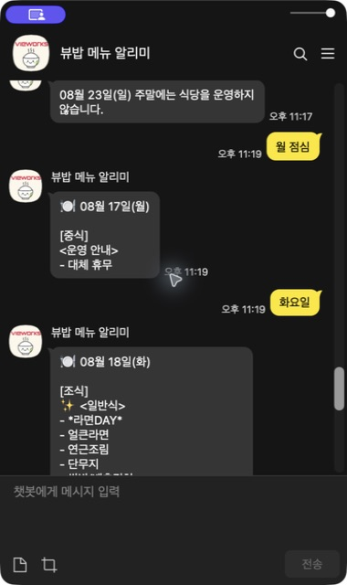
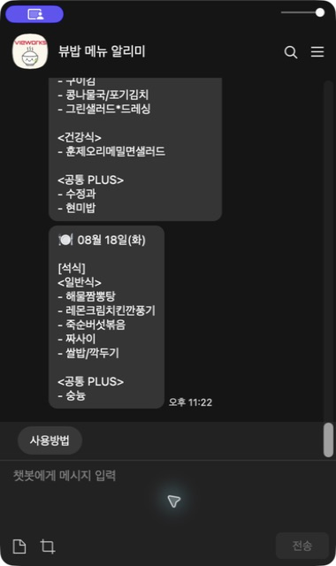
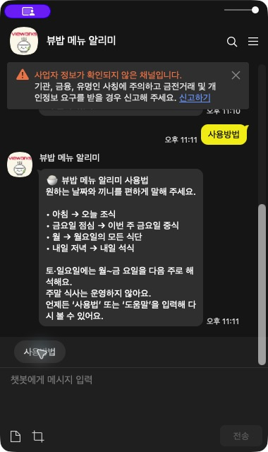
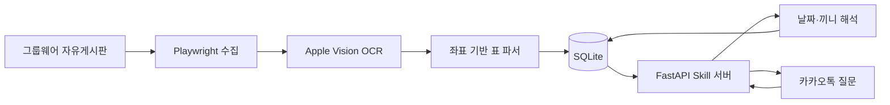

# 뷰밥 메뉴 알리미

사내 그룹웨어에 이미지로 게시되는 주간 식단표를 자동 수집하고, macOS의 온디바이스 한국어 OCR로 구조화한 뒤 카카오톡 질문에 답하는 챗봇입니다.

[카카오톡 채널 열기](https://pf.kakao.com/_xniMSX) · 현재 운영 버전 `v1.1`

> 공개 포트폴리오용 저장소에는 회사 내부 URL, 계정, 게시물 ID, 원본 이미지, OCR 결과와 실제 메뉴 DB를 포함하지 않습니다. 운영 값은 로컬 `.env`에서만 관리합니다.

## 프로젝트 한눈에 보기

| 항목 | 내용 |
|---|---|
| 수집 대상 | 자유게시판의 주간 식단 게시물(과거 지점 게시물은 파서 검증에만 활용) |
| 처리 | 게시물 탐색 → 이미지 수집 → 좌표 기반 OCR → 날짜·끼니·코너 정규화 → SQLite 저장 |
| 질문 예시 | `아침`, `금요일 점심`, `내일 저녁`, `월요일` |
| 응답 | 실제 날짜, 조식·중식·석식, 일반식·간편식·건강식·공통 PLUS 메뉴 |
| 기술 | Python, Playwright, Apple Vision, SQLite, FastAPI, Kakao 챗봇 Skill API |
| 조사 범위 | 최근 1년 72개 게시물, 168개 이미지 후보 전수 조사 |

## 사용자 규칙

- 월~금에는 요일을 이번 주 날짜로 해석합니다.
- 토~일에도 요일은 현재 주 날짜로 해석합니다.
- `아침`, `점심`, `저녁`만 말하면 오늘 해당 끼니를 보여줍니다.
- `월`, `월요일`처럼 끼니 없이 요일만 말하면 그날의 모든 식단을 보여줍니다.
- `금욜`, `낼점심`, `담주월 아침` 같은 일상적인 줄임말도 인식합니다.
- `다음주`, `담주`, `차주` 요청은 제공하지 않고 이번 주 식단만 조회할 수 있다고 안내합니다.
- `이번주 점심`처럼 요일이 빠진 질문은 오늘 식단으로 넘기지 않고 요일 입력을 안내합니다.
- 날짜·요일·끼니가 둘 이상 섞이거나 잘못된 날짜가 들어오면 임의로 선택하지 않고 다시 물어봅니다.
- 모든 답변에 `08월 21일(금)` 같은 실제 날짜를 표시합니다.
- `토`, `일`, `토요일`, `일요일`을 입력하면 식당이 운영되지 않는다고 안내합니다.
- 과거 식단 조회는 지원하지 않습니다. 1년치 자료는 예외 패턴 검증에만 사용합니다.
- 운영용 수집은 현재 주 날짜만 저장하며, 1년치 자료는 별도 학습 모드에서만 사용합니다.
- 차주 식단표가 주말에 게시되더라도 저장하지 않으므로 운영 자동 수집은 월요일 아침에 실행해야 합니다.
- PLUS 코너는 `공통 PLUS`로 표시합니다.
- 메뉴는 코너별 세로 목록으로 표시하고, 하루 전체 조회는 끼니별 말풍선으로 나눕니다.
- 모든 답변 아래의 `사용방법` 버튼으로 도움말을 다시 열 수 있습니다.

## 실행 화면

### 날짜·끼니 질문

| `월 점심` → 월요일 중식 | `화요일` → 조식·중식·석식 전체 |
|---|---|
|  |  |

`월 점심`처럼 요일과 끼니를 함께 말하면 해당 끼니만, `화요일`처럼 요일만 말하면 조식·중식·석식을 끼니별 말풍선으로 보여줍니다.

### 사용방법



운영 채널 `v1.1`에서 실제 카카오톡으로 식단 조회, 도움말 응답과 `사용방법` 퀵 리플라이 재호출을 검증했습니다.

## 확인한 예외와 처리

| 상황 | 처리 |
|---|---|
| 대체휴무·공휴일·전사휴무 | 해당 날짜 세 끼 모두 미운영 |
| `석식 미운영`, `조식 미제공` | 해당 끼니만 미운영 |
| 특식·DAY·영양사 픽 | 특식 상태와 `✨` 표시 |
| 특식으로 건강식 없음 | 없는 코너를 추측해 만들지 않음 |
| 과거 지점별 게시물 혼재 | 학습·파서 검증에만 사용하고 사용자 응답에서는 지점을 노출하지 않음 |
| 안내 포스터 혼입 | 날짜 열과 끼니 행이 없는 이미지는 제외 |
| OCR 중복 | 날짜·지점·끼니·코너가 같으면 더 풍부한 결과를 채택 |

최근 1년치 게시물과 이미지 후보를 전수 조사해 표 구조 변화와 예외 패턴을 검증했습니다. 실제 게시물 목록, 원본 이미지, OCR 결과와 메뉴 데이터는 공개 저장소에 포함하지 않습니다.

## 구조



OCR은 게시물 수집 시에만 수행하고, 카카오 요청에는 SQLite 조회만 실행합니다.

## 비용과 운영 범위

개인 맥과 ngrok Free를 사용하면 고정 월 비용은 0원입니다.

- Apple Vision OCR, SQLite, FastAPI: 로컬 실행, 무료
- 카카오 일반 스킬 응답: 유료 Event API를 사용하지 않음
- ngrok Free: 고정 개발 도메인 1개, 월 20,000 HTTP 요청, 1GB 전송

500명이 근무일마다 하루 한 번 조회하면 월 약 11,000건입니다. 하루 두 번이면 약 22,000건으로 ngrok 무료 한도를 넘을 수 있습니다. 시범 운영 후 한도에 가까워지면 Cloudflare Workers 무료 엔드포인트로 이전할 수 있습니다. 맥이 잠자거나 종료되면 챗봇도 응답하지 않습니다.

## macOS 설치

요구사항: macOS 14+, Python 3.11+, Google Chrome, Xcode Command Line Tools.

```bash
cd "/Users/hongmin/Desktop/자동화/cafeteria-menu-kakao-bot"
python3 -m venv .venv
source .venv/bin/activate
pip install -e '.[dev]'
playwright install chromium
cp .env.example .env
```

```dotenv
GROUPWARE_USER=사원번호
GROUPWARE_PASSWORD=비밀번호
GROUPWARE_URL=https://groupware.example.com/path/to/board
POST_PREFIXES=뷰웍스
DEFAULT_LOCATION=
DATABASE_PATH=data/menus.db
TIMEZONE=Asia/Seoul
KAKAO_WEBHOOK_TOKEN=충분히-긴-임의-문자열
NGROK_DOMAIN=계정에-할당된-도메인.ngrok-free.dev
```

## 실행

```bash
menu-bot scrape --pages 2 --output data/latest_manifest.json
menu-bot ingest data/latest_manifest.json
# 1년치 OCR·파서 검증 전용(운영 DB와 분리해서 사용)
menu-bot ingest data/history_manifest.json --learning
menu-bot ask "금요일 아침"

# 터미널 1
./scripts/run-mac-server.sh

# 터미널 2
./scripts/run-mac-tunnel.sh
```

카카오 스킬 URL:

```text
https://NGROK_DOMAIN/kakao/skill/KAKAO_WEBHOOK_TOKEN
```

## 카카오 챗봇 연결

1. `뷰밥 메뉴 알리미` 봇에 위 HTTPS 주소를 POST 스킬로 등록합니다.
2. 식단 질문용 블록에 발화 예시와 `sys.any` 파라미터를 연결합니다.
3. 블록 응답을 등록한 스킬로 설정합니다.
4. 봇 테스트에서 `오늘 점심`, `금요일 아침`, `월요일`, `토요일 점심`을 확인합니다.
5. 카카오톡 채널을 연결하고 배포합니다.

서버는 SkillPayload의 `userRequest.utterance`를 읽고 SkillResponse 2.0으로 답합니다. 긴 하루 전체 메뉴는 끼니별 말풍선으로 나누며, 모든 응답에 `사용방법` 퀵 리플라이를 포함합니다. 이미 열어 둔 채팅방에는 웰컴 메시지가 소급 생성되지 않으므로 `안녕하세요` 또는 `사용방법`을 한 번 입력하면 도움말과 버튼이 표시됩니다.

## 보안

- `.env`, 이미지, OCR 캐시, SQLite DB와 게시물 목록은 Git 제외 대상입니다.
- 카카오 요청 중에는 그룹웨어에 로그인하지 않습니다.
- 웹훅 URL에는 긴 임의 토큰을 붙입니다.
- 비밀번호와 토큰을 로그나 README에 출력하지 않습니다.
- 공개 Git에는 내부 주소나 실제 식단 데이터를 커밋하지 않습니다.

## 검증

```bash
pytest
python -m compileall -q src tests
curl http://127.0.0.1:8000/health
```

## License

MIT
