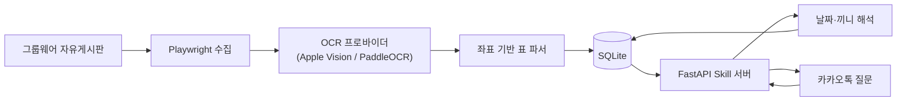

# 뷰밥 메뉴 알리미

사내 그룹웨어에 이미지로 게시되는 주간 식단표를 자동 수집하고, 온디바이스 한국어 OCR(macOS: Apple Vision, Windows: PaddleOCR)로 구조화한 뒤 카카오톡 질문에 답하는 챗봇입니다.

[카카오톡 채널 열기](https://pf.kakao.com/_xniMSX) · 현재 운영 버전 `v1.2`

> 공개 포트폴리오용 저장소에는 회사 내부 URL, 계정, 게시물 ID, 원본 이미지, OCR 결과와 실제 메뉴 DB를 포함하지 않습니다. 운영 값은 로컬 `.env`에서만 관리합니다.

## 프로젝트 한눈에 보기

| 항목 | 내용 |
|---|---|
| 수집 대상 | 자유게시판의 주간 식단 게시물(과거 지점 게시물은 파서 검증에만 활용) |
| 처리 | 게시물 탐색 → 이미지 수집 → 좌표 기반 OCR → 날짜·끼니·코너 정규화 → SQLite 저장 |
| 질문 예시 | `아침`, `금요일 점심`, `내일 저녁`, `월요일` |
| 응답 | 실제 날짜, 조식·중식·석식, 일반식·간편식·건강식·공통 PLUS 메뉴 |
| 기술 | Python, Playwright, Apple Vision / PaddleOCR, SQLite, FastAPI, Kakao 챗봇 Skill API |
| 조사 범위 | 최근 1년 72개 게시물, 168개 이미지 후보 전수 조사 |
| 실행 환경 | macOS(개인기) · Windows(사내 PC) 양쪽 운영 지원 |

## 사용자 규칙

- 월~금에는 요일을 이번 주 날짜로 해석합니다.
- 토~일에도 요일은 현재 주 날짜로 해석합니다.
- `아침`, `점심`, `저녁`만 말하면 오늘 해당 끼니를 보여줍니다.
- `월`, `월요일`처럼 끼니 없이 요일만 말하면 그날의 모든 식단을 보여줍니다.
- `금욜`, `낼점심`, `담주월 아침` 같은 일상적인 줄임말도 인식합니다.
- `다음주`, `담주`, `차주` 요청은 제공하지 않고 이번 주 식단만 조회할 수 있다고 안내합니다.
- `이번주 점심`처럼 요일이 빠진 질문은 오늘 식단으로 넘기지 않고 요일 입력을 안내합니다.
- 날짜·요일·끼니가 둘 이상 섞이거나 잘못된 날짜가 들어오면 임의로 선택하지 않고 다시 물어봅니다.
- 모든 답변에 `08월 21일(금)` 같은 실제 날짜를 표시합니다.
- `토`, `일`, `토요일`, `일요일`을 입력하면 식당이 운영되지 않는다고 안내합니다.
- 과거 식단 조회는 지원하지 않습니다. 1년치 자료는 예외 패턴 검증에만 사용합니다.
- 운영용 수집은 현재 주 날짜만 저장하며, 1년치 자료는 별도 학습 모드에서만 사용합니다.
- 차주 식단표가 주말에 게시되더라도 저장하지 않으므로 운영 자동 수집은 월요일 아침에 실행해야 합니다.
- PLUS 코너는 `공통 PLUS`로 표시합니다.
- 메뉴는 코너별 세로 목록으로 표시하고, 하루 전체 조회는 끼니별 말풍선으로 나눕니다.
- 모든 답변 아래의 `사용방법` 버튼으로 도움말을 다시 열 수 있습니다.

## 실행 화면

### 날짜·끼니 질문

| `월 점심` → 월요일 중식 | `화요일` → 조식·중식·석식 전체 |
|---|---|
|  |  |

`월 점심`처럼 요일과 끼니를 함께 말하면 해당 끼니만, `화요일`처럼 요일만 말하면 조식·중식·석식을 끼니별 말풍선으로 보여줍니다.

### 사용방법


운영 채널 `v1.2`에서 실제 카카오톡으로 식단 조회, 도움말 응답과 `사용방법` 퀵 리플라이 재호출을 검증했습니다.

## 확인한 예외와 처리

| 상황 | 처리 |
|---|---|
| 대체휴무·공휴일·전사휴무 | 해당 날짜 세 끼 모두 미운영 |
| `석식 미운영`, `조식 미제공` | 해당 끼니만 미운영 |
| 특식·DAY·영양사 픽 | 특식 상태와 `✨` 표시 |
| 특식으로 건강식 없음 | 없는 코너를 추측해 만들지 않음 |
| 과거 지점별 게시물 혼재 | 학습·파서 검증에만 사용하고 사용자 응답에서는 지점을 노출하지 않음 |
| 안내 포스터 혼입 | 날짜 열과 끼니 행이 없는 이미지는 제외 |
| OCR 중복 | 날짜·지점·끼니·코너가 같으면 더 풍부한 결과를 채택 |

최근 1년치 게시물과 이미지 후보를 전수 조사해 표 구조 변화와 예외 패턴을 검증했습니다. 실제 게시물 목록, 원본 이미지, OCR 결과와 메뉴 데이터는 공개 저장소에 포함하지 않습니다.

## 구조



OCR은 게시물 수집 시에만 수행하고, 카카오 요청에는 SQLite 조회만 실행합니다.

## OCR 엔진

`src/menu_bot/ocr_provider.py`가 OCR 백엔드를 플랫폼별로 감춥니다.

| 플랫폼 | 엔진 | 비고 |
|---|---|---|
| macOS | Apple Vision (`vision_ocr.swift`, on-device) | 기존 운영 방식 그대로 유지 |
| Windows | PaddleOCR(`PP-OCRv5_mobile_det` + `korean_PP-OCRv5_mobile_rec`), 로컬 CPU 실행 | 외부 유료 OCR API 미사용 |

`OCR_PROVIDER` 환경변수(`auto`\|`apple_vision`\|`paddleocr`)로 강제 지정할 수 있으며, 기본값 `auto`는 `platform.system()`으로 자동 선택합니다. 두 엔진 모두 결과를 동일한 `{text, confidence, x, y, width, height}` 정규화 좌표(좌측 하단 원점, y축 위로 증가)로 변환해 파서가 엔진을 구분하지 않고 동작합니다.

**Windows OCR 검증**: 1년치 실제 게시물 중 대체휴무 전체휴무, 특정 끼니 미운영, 특식/DAY, PLUS 공통 코너가 섞인 실제 이미지 6장을 PaddleOCR로 다시 OCR해 Apple Vision 결과와 파싱 결과(항목 수·상태 분류·날짜별 셀 구성)를 비교했고, 6장 전부 100% 일치했습니다. 글자 단위로는 `숭늉`이 `숭능`/`숭늄`처럼 드물게 오인식되는 등 사소한 품질 차이가 있지만 끼니·날짜·특식/휴무 판정에는 영향이 없습니다. Windows 실제 그룹웨어 계정으로 라이브 로그인 → 수집 → PaddleOCR → 파싱 → SQLite 저장 → 카카오 스킬 응답까지 전 과정을 실제로 확인했습니다.

## 비용과 운영 범위

개인 맥/사내 Windows PC와 ngrok Free를 사용하면 고정 월 비용은 0원입니다.

- Apple Vision / PaddleOCR, SQLite, FastAPI: 로컬 실행, 무료
- 카카오 일반 스킬 응답: 유료 Event API를 사용하지 않음
- ngrok Free: 고정 개발 도메인 1개, 월 20,000 HTTP 요청, 1GB 전송

500명이 근무일마다 하루 한 번 조회하면 월 약 11,000건입니다. 하루 두 번이면 약 22,000건으로 ngrok 무료 한도를 넘을 수 있습니다. 시범 운영 후 한도에 가까워지면 Cloudflare Workers 무료 엔드포인트로 이전할 수 있습니다. 서버 PC가 잠자거나 종료되면 챗봇도 응답하지 않습니다.

> **ngrok 최소 에이전트 버전 이슈(Windows, 미해결)**: 이 ngrok 계정은 에이전트 3.20.0 이상을 요구합니다(`ERR_NGROK_121`). winget으로 설치되는 3.3.1은 이 조건을 충족하지 못하고, `ngrok update`로 최신 버전을 받으면 회사 Defender가 `Trojan:Win32/Kepavll!rfn`으로 새 바이너리를 격리합니다(Go 바이너리 자동 업데이트에 흔한 오탐이지만 사내 PC에서 임의로 예외 처리하지 않았습니다). 실제 터널 운영 전 IT에 `ngrok.exe`(경로: `%LOCALAPPDATA%\Microsoft\WinGet\Packages\Ngrok.Ngrok_*\ngrok.exe` 및 갱신 파일) 허용 또는 3.20.0 이상 버전의 사전 승인을 요청해야 합니다.

## Windows 설치

요구사항: Windows 10/11, Python 3.13(PaddleOCR wheel은 3.13에서만 검증. 3.14는 미검증), Google Chrome, PowerShell 5.1+.

```powershell
cd "회사 PC의 프로젝트 경로"
powershell -ExecutionPolicy Bypass -File scripts\install-windows.ps1
copy .env.example .env
notepad .env   # 그룹웨어 계정, 카카오 토큰, ngrok 도메인 입력
powershell -ExecutionPolicy Bypass -File scripts\check-windows-env.ps1
```

`check-windows-env.ps1`은 Python/Chrome/ngrok 설치 여부, ngrok 설정 파일 유효성, 아웃바운드 443 연결, `.env` 필수 키 존재 여부(값은 출력하지 않음), 그룹웨어 호스트 접속 가능 여부를 읽기 전용으로 점검합니다.

### Windows 실행

```powershell
# 터미널 1: 서버
powershell -ExecutionPolicy Bypass -File scripts\run-windows-server.ps1

# 터미널 2: 터널
powershell -ExecutionPolicy Bypass -File scripts\run-windows-tunnel.ps1

# 수동 수집(평소엔 자동 실행되므로 필요할 때만)
.venv\Scripts\menu-bot.exe scrape --pages 2 --output data\latest_manifest.json
.venv\Scripts\menu-bot.exe ingest data\latest_manifest.json
.venv\Scripts\menu-bot.exe ask "금요일 아침"
```

`run-windows-server.ps1`, `run-windows-tunnel.ps1`은 내부에 재시작 루프가 있어 uvicorn/ngrok 프로세스가 죽으면 5초 뒤 자동으로 다시 시작하고, `logs\*.log`에 날짜별로 기록합니다(30일 지난 로그는 자동 삭제).

## 다음 주 게시글 확인(주말 자동 폴링)

차주 식단표는 보통 주말에 게시되지만 운영 DB는 항상 "이번 주"만 저장하므로, 평소 운영 수집은 월요일 아침 한 번만 실행됩니다. 다만 게시가 언제 끝나는지 미리 알 수 있으면 월요일 0시부터 곧바로 응답할 수 있어, 별도의 확인 작업을 둡니다.

- **금요일 22:00** 1회, **토·일요일 00:05부터 2일간 2시간 간격** 반복으로 `menu-bot check-next-week`가 게시글 제목만 가볍게 확인합니다(이미지 다운로드 없음).
- 다음 주 게시글을 찾으면 **그 자리에서** 이미지 다운로드·OCR·파싱까지 끝내고 `week_start`를 다음 주 월요일로 저장합니다. 카카오 응답은 실제 달력 날짜로 필터링되므로, 데이터가 주말에 미리 들어가 있어도 월요일 0시 전에는 노출되지 않다가 자정이 지나는 순간 자동으로 조회됩니다.
- 한 번 확인되면 상태 파일(`data/next_week_watch_state.json`)에 대상 주차가 기록되어, 같은 주말 안의 나머지 2시간 간격 실행은 그룹웨어에 다시 접속하지 않고 즉시 종료합니다(주차가 바뀌면 다음 주에 자동으로 다시 확인).
- 월요일 08:00 운영 수집은 안전망으로 그대로 유지합니다. 주말에 이미 확인·저장됐다면 같은 게시물을 다시 처리해도 동일한 `source_post_id`로 안전하게 덮어씁니다.

## Windows 자동 시작(작업 스케줄러)

Windows 서비스 대신 **작업 스케줄러**를 선택했습니다. Playwright(Chrome)와 ngrok을 사용자 세션 그대로 띄우는 편이 서비스용 세션 0 격리 문제나 별도 서비스 래퍼(NSSM 등) 없이 훨씬 단순하고, 관리자 권한 없이 현재 사용자 계정만으로 등록·점검·삭제할 수 있기 때문입니다. 재시작은 스케줄러의 제한된 횟수 대신 각 `run-windows-*.ps1` 안의 무한 루프가 1차로 책임지고, 스케줄러 설정에도 방어적으로 재시작(최대 999회, 1분 간격)을 걸어 둡니다.

```powershell
powershell -ExecutionPolicy Bypass -File scripts\register-windows-tasks.ps1
```

등록되는 작업:

| 작업 이름 | 트리거 | 동작 |
|---|---|---|
| `VieworksMenuBot-Server` | 로그온 시 | FastAPI 서버, 죽으면 5초 후 자동 재시작 |
| `VieworksMenuBot-Tunnel` | 로그온 시 | ngrok 터널, 죽으면 5초 후 자동 재시작 |
| `VieworksMenuBot-Collect` | 매주 월요일 08:00 | 운영 수집(scrape+ingest), 안전망 |
| `VieworksMenuBot-NextWeekWatch-Friday` | 매주 금요일 22:00 | 다음 주 게시글 1회 확인 |
| `VieworksMenuBot-NextWeekWatch-Weekend` | 매주 토요일 00:05부터 2일간 2시간 간격 | 다음 주 게시글 반복 확인(확인되면 즉시 종료) |

확인: `Get-ScheduledTask -TaskName 'VieworksMenuBot-*'` · 제거: `Get-ScheduledTask -TaskName 'VieworksMenuBot-*' | Unregister-ScheduledTask -Confirm:$false`

## macOS 설치

요구사항: macOS 14+, Python 3.11+, Google Chrome, Xcode Command Line Tools.

```bash
cd "/Users/hongmin/Desktop/자동화/cafeteria-menu-kakao-bot"
python3 -m venv .venv
source .venv/bin/activate
pip install -e '.[dev]'
playwright install chromium
cp .env.example .env
```

```dotenv
GROUPWARE_USER=사원번호
GROUPWARE_PASSWORD=비밀번호
GROUPWARE_URL=https://groupware.example.com/path/to/board
POST_PREFIXES=뷰웍스
DEFAULT_LOCATION=
DATABASE_PATH=data/menus.db
TIMEZONE=Asia/Seoul
KAKAO_WEBHOOK_TOKEN=충분히-긴-임의-문자열
NGROK_DOMAIN=계정에-할당된-도메인.ngrok-free.dev
```

### macOS 실행

```bash
menu-bot scrape --pages 2 --output data/latest_manifest.json
menu-bot ingest data/latest_manifest.json
# 1년치 OCR·파서 검증 전용. --learning은 항상 `menus.learning.db`(운영 DB와 다른 파일)에 저장된다.
menu-bot ingest data/history_manifest.json --learning
menu-bot ask "금요일 아침"

# 터미널 1
./scripts/run-mac-server.sh

# 터미널 2
./scripts/run-mac-tunnel.sh
```

카카오 스킬 URL:

```text
https://NGROK_DOMAIN/kakao/skill/KAKAO_WEBHOOK_TOKEN
```

## 카카오 챗봇 연결

1. `뷰밥 메뉴 알리미` 봇에 위 HTTPS 주소를 POST 스킬로 등록합니다.
2. 식단 질문용 블록에 발화 예시와 `sys.any` 파라미터를 연결합니다.
3. 블록 응답을 등록한 스킬로 설정합니다.
4. 봇 테스트에서 `오늘 점심`, `금요일 아침`, `월요일`, `토요일 점심`을 확인합니다.
5. 카카오톡 채널을 연결하고 배포합니다.

서버는 SkillPayload의 `userRequest.utterance`를 읽고 SkillResponse 2.0으로 답합니다. 긴 하루 전체 메뉴는 끼니별 말풍선으로 나누며, 모든 응답에 `사용방법` 퀵 리플라이를 포함합니다. 이미 열어 둔 채팅방에는 웰컴 메시지가 소급 생성되지 않으므로 `안녕하세요` 또는 `사용방법`을 한 번 입력하면 도움말과 버튼이 표시됩니다.

## 보안

- `.env`, 이미지, OCR 캐시, SQLite DB와 게시물 목록은 Git 제외 대상입니다.
- 카카오 요청 중에는 그룹웨어에 로그인하지 않습니다.
- 웹훅 URL에는 긴 임의 토큰을 붙입니다.
- 비밀번호와 토큰을 로그나 README에 출력하지 않습니다.
- 공개 Git에는 내부 주소나 실제 식단 데이터를 커밋하지 않습니다.
- PaddleOCR은 완전히 로컬 CPU에서만 실행되며 이미지나 인식 결과를 외부로 전송하지 않습니다.
- Windows의 ngrok 인증 설정(`windows-transfer-secrets/ngrok.yml`)은 Git 제외 대상이며, `%LOCALAPPDATA%\ngrok\ngrok.yml`로 복사해 사용하고 저장소에는 두지 않습니다.

## 검증

```bash
pytest
python -m compileall -q src tests
curl http://127.0.0.1:8000/health
```

Windows에서는 `.venv\Scripts\python.exe`로 동일하게 실행하거나 `scripts\check-windows-env.ps1`로 환경을 점검합니다. 이번 작업에서 실제로 확인한 항목:

- `pytest` 70개 전체 통과(신규 `next_week_watch` 테스트 4개 포함), `compileall` 통과.
- 실제 그룹웨어 계정으로 라이브 로그인 → 3개 게시물 스크래핑 → PaddleOCR OCR → 파싱 → SQLite 저장(이번 주 36개 메뉴, 지난 2주치 79개는 운영 DB 정책대로 필터링).
- 실행 중인 FastAPI 서버에 실제 `SkillPayload` POST(`목요일 점심`)로 SkillResponse 2.0 정상 응답(HTTP 200) 확인.
- Git 추적 대상 파일에 실제 계정/토큰/내부 URL이 없는지 값 대조로 검사(발견 없음).
- 재부팅/로그오프 후 자동 시작은 작업 스케줄러 등록까지 완료했으며, 실제 재부팅을 통한 검증은 아직 하지 않았습니다.

## License

MIT
